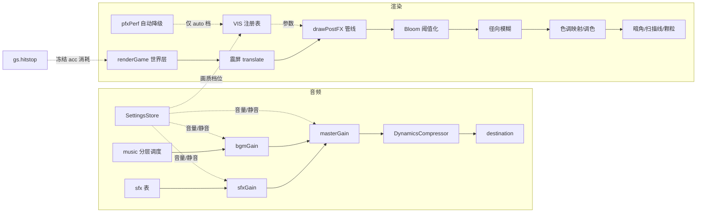

## 产品概述

对 NEON ASCENT（霓虹攀升）进行分两批的音画全面升级：音乐从"单轨低音循环"升级为分层自适应 BGM，音效从"提示音"升级为有质感、有空间感、有层次的表现；美术在保持霓虹几何风格的前提下强化后期光效、打击反馈与场景角色质感，并为每张地图赋予独立主题配色；同时提供玩家可调节的音量与画质设置，并本地持久保存。

## 核心特性

### 一、音乐与音效（第一批）

- 分层动态 BGM：低音 / 琶音 / 铺底 / 打击四层，随玩法强度与场景状态（菜单、游戏中、死亡后紧张段、加速、检查点、通关）渐变进出，段落间平滑过渡
- 音效重制：更厚实有质感的跳跃、冲刺、落地、拾取、破碎音；补齐缺失事件（二段跳、复活、激光预警、界面悬停与点击）
- 空间感：按事件在屏幕上的左右位置产生声像偏移，远离视野中心的声音自然减弱
- 听感保护：同名音效并发节流与总线限幅，避免连续触发时的爆音与削波

### 二、音量与画质设置（配套）

- 主音量 / 音乐 / 音效三条独立音量条与静音开关
- 画质档位：低 / 中 / 高 / 自动，统一控制泛光、色散、颗粒、模糊与粒子数量
- 全部设置本地保存，下次启动自动恢复

### 三、后期与光效（第二批）

- 泛光、色散、暗角、扫描线、颗粒参数集中可调并随画质档位变化
- 新增高速径向模糊、色调映射与分区调色、更细腻的震屏曲线与命中停顿
- 帧率不足时自动降级，优先保证流畅

### 四、粒子与打击感

- 新增拖尾、光环、冲击波、火花四类粒子，覆盖死亡、破盾、弹射、冲刺、通关等关键瞬间
- 高速时的速度线、落地与命中的屏幕反馈
- 关键瞬间加入极短命中停顿，强化冲击

### 五、场景与角色质感

- 每张地图拥有独立主题配色，驱动平台渐变、背景视差、雾气与网格色调
- 统一几何绘制原语升级：更强的体积感、边缘光与顶光，平台 / 危险物 / 道具 / 玩家整体观感抬升

## 技术栈

- 沿用现有栈：Vite 8 + TypeScript 6 + bitecs，渲染为 **Canvas 2D**（无 WebGL、无第三方渲染库）
- 音频：**WebAudio API 纯代码合成**，零外部音频素材（包体不变）
- 复用现有底座：`core/canvas`（VW=1280 / VH=720 / PPM=48 / DPR≤2）、`core/camera`、`config/` 纯数据注册表层、`Prefabs/` 绘制层、`systems/` 逻辑层、`core/uiComponent`（Button / Toggle / TextInput / UIManager）
- 持久化：`localStorage`（项目当前无持久化模块，新增 `src/core/settings.ts`）

## 实现方案

### 第一批：音频体系

**A1 分轨总线（`src/core/audio.ts` 内部重构）**

- 节点图常驻一次性构建：`source → sfxGain | bgmGain → masterGain → compressor → destination`
- **向后兼容**：`AU` 单例、`sfx.*` 方法签名、`AU.on` 开关、`musicTick()` 全部保留，内部改走对应总线；新增 `AU.vol { master, sfx, bgm }`
- 限幅：master 后接 `DynamicsCompressor`（threshold -12dB / ratio 6 / knee 12 / attack 0.003 / release 0.18），防叠加削波
- 节流：`Map<string, number>` 记录同名音效上次触发时间，最小间隔 30~50ms（land 40ms、orb 30ms）
- 空间感：`sfx.*` 增加可选参数 `{ pan?, gain? }`，内部用 `StereoPannerNode`（不支持时降级为纯音量衰减）；调用方按 `sx(x)/VW` 换算 pan
- 生命周期：每次播放新建的 osc / gain 节点在 `onended` 中断开（现有代码只 stop 不 disconnect，长时间游玩会累积）

**A2 分层动态 BGM（新增 `src/core/music.ts`，从 `audio.ts` 拆出）**

- 四层：`bass`（锯齿+低通）、`arp`（三角/方波 16 分音符）、`pad`（双失谐锯齿 + 慢速滤波扫描 + 长包络）、`perc`（噪声 hi-hat + 正弦下滑 kick）
- 结构：16 步为 1 小节、4 小节为 1 段，段落表驱动层开关；音高用小调音阶级数数组生成，不写死音符表
- 状态机：`menu`（稀疏 pad+arp）/ `playing`（全层）/ `tension`（死亡后短暂降层）/ `victory`（上行琶音 + 亮 pad），切换用 `setTargetAtTime` 做 0.4~0.8s 交叉淡变
- 强度：`intensity 0..1`（由速度倍率 / 连击 / 光球收集进度映射）调节 perc 与 arp 的音量与密度
- 调度：沿用现有"以 AudioContext 时钟前瞻 0.16s"的模式（掉帧不影响节奏）；暂停时停止调度、恢复时重置 `MUS.next`
- 复杂度：每帧调度步数为常数 O(前瞻窗口/步长)，无遍历增长

**A3 音效重制与补全**

- 统一"音色配方"：频率扫掠 + ADSR（`setValueAtTime` / `linearRampToValueAtTime` / `exponentialRampToValueAtTime`）+ 可选滤波 + 副振荡器微失谐（+7 cents）叠厚
- 重做 jump / dash / land / orb / die / win / spring / hook；新增 doubleJump / respawn / laserWarn / uiHover / uiClick
- 响度归一化：所有音效峰值收敛到 -12~-8 dBFS，避免个别音效过响

### 第二批：美术管线

**B1 视觉参数集中化 + 画质档位**

- `src/config/visuals.ts` 扩展为 `VIS` 注册表：`postfx`（现有 PFX 全部字段）、`particles`（池上限、发射倍率）、`screen`（震屏幅度/衰减/频率、hitstop 参数）、`speedLines`（阈值/数量/长度）。该文件已在 `config/index.ts` 中导出，是现有架构下的天然落点
- 新增 `src/core/settings.ts`：`SettingsStore`（master / sfx / bgm 音量、muted、quality、postfx 总开关），localStorage 键 `dash.settings.v1`，读写带 try/catch 与字段校验（防旧版/脏数据），导出 `applyQuality(tier)` 把档位写回 `VIS.postfx` 与粒子预算
- `postfx.ts` 的 `PFX` 默认值改为从 `VIS.postfx` 初始化；`pfxPerf()` 自动降级改为**仅在 `quality === 'auto'` 时生效**，手动档位不被覆盖

**B2 后期管线升级**

- Bloom：亮部提取加阈值（离屏 1/4 分辨率），解决当前自乘方式导致的整体发灰
- 径向模糊（速度感）：在离屏上以画面中心为锚做 4 次递减缩放叠加，强度 = f(速度)，仅冲刺/高速时启用
- 色调映射与调色：管线末端一次全屏 `overlay` 渐变叠色（色值取自地图主题），高光做轻微 rolloff
- 震屏：`gs.shake` 改为 trauma 模型（平方映射 + 噪声抖动 + 指数衰减），在 `renderGame` 开头 `ctx.translate` 一次，统一作用于世界层（HUD 与后处理不受影响）
- hitstop：新增 `gs.hitstop`；主循环 `frame()` 中若 `hitstop > 0` 则本帧**不消耗 acc**（不执行 `step(FDT)`），只衰减 hitstop 并渲染 —— 物理仍是整数个 FDT 步，确定性不受影响
- 性能：全屏渐变按 `(VW, VH, DPR)` 键缓存（沿用 `uiAtmosphere.vignetteGradient` 模式）；每帧全屏 `drawImage` 控制在 ≤6 次；径向模糊与色散在 `quality < high` 时关闭

**B3 粒子与打击感**

- `ParticleKind` 扩展为 `'dot' | 'frag' | 'arrow' | 'streak' | 'ring' | 'shock'`；`Particle` 增加可选字段 `len`（拖尾长度）/ `r0,r1`（环起止半径）/ `lw`（线宽），旧预设不填即走原路径
- 绘制：streak 沿速度方向画圆头线段；ring 为渐隐描边圆环；shock 为双层外扩描边圆；均复用现有 `lighter` 合成
- 性能：按类型分桶批量绘制（一次设置合成模式与 lineCap 后遍历），减少 `save/restore`；池上限按档位（低 140 / 中 280 / 高 420）
- 速度线：在 `drawTrail` 中按速度阈值绘制放射短线，参数取 `VIS.speedLines`
- 反馈接入：`wirePlayerEvents` 的 `player:died` / `player:springed`、以及 `CollisionHooks` 破盾分支设置 `gs.hitstop` 与 `gs.shake`；新增对应 FX 预设

**B4 场景与角色质感 + 地图主题**

- `MapDefinition` 增加可选 `theme?: MapTheme`（hue 渐变端点、fog 色、grid 色、视差远/中层色、accent 功能色）
- `platforms.ts` 的 `hue2()` 改为读取 `currentMap.theme`（缺省回退现有 196→296 公式）；`drawBorder` / `drawGrid` / `drawDecos` 同步取主题色
- `atmosphere.ts` 的 `drawFog` / `drawParallax` 与 `config/background.ts` 的颜色改为由主题派生（缺省保持现硬编码）
- `theme.ts` 的 `neonBox` 升级 v3：在现有五步之上增加"底部内阴影渐变"与"外侧 1px 冷光描边"，新参数进 `T` 令牌
- 角色：`Prefabs/Player/default/render.ts` 增加边缘光与落地压缩/起跳拉伸形变（纯参数化，**不改 `AnimOutput` 契约**）

**B5 设置面板**

- 先确认 `core/uiComponent/manager.ts` 是否已分发 `mousemove/mouseup`：若已分发则新增 `Slider.ts` 支持拖拽；若未分发则用"点击轨道定位 + 离散 0-10 档按钮"实现，避免改动底座事件系统
- 新增 `src/systems/ui/settings.ts`：`buildSettingsScene()`，复用 `primitives.ts` 的 `drawMask` / `drawGlassPanel` / `drawTitle` / `makeBackButton`，含三条音量条 + 静音开关 + 画质四选一 + 后处理总开关 + 返回
- `UI_SCENE` 增加 `SETTINGS`；`scenes.ts` 注册；`menu.ts` 与 `pause.ts` 各加入口（pause 走 `ui.pushOverlay('settings')`）
- 接线：`onChange → SettingsStore.set() →` 立即写回 `AU.vol` / `VIS.postfx` / 粒子预算；`main.ts` 初始化阶段调用 `SettingsStore.load()`

### 架构关系



## 实现备注（防回归要点）

- **物理红线**：`FDT = 1/120` 固定步长严禁改为可变 dt；hitstop 只影响主循环是否消耗 `acc`，不进入物理步。门禁：`npx vitest run src/__smoke__/` 与 `tsc --noEmit` 必须每次通过
- **联机红线**：远端玩家 tick 仍传 `sfx: false`；新增音效调用点必须走本地事件或 `sfx` 开关分支。**房主联机会话（`inSession() && isHost()`）禁用 hitstop**，避免影响权威模拟与远端预测
- **对象引用**：`PFX` 是可变单例且被 `drawPostFX` 直接读取，`applyQuality()` 必须**原地写字段**，不可整体替换对象引用，否则外部持有的旧引用失效
- **缓存**：所有全屏 `createLinearGradient` / `createRadialGradient` 按 `(VW, VH, DPR)` 键缓存，禁止每帧新建（沿用 `uiAtmosphere.vignetteGradient` 既有模式）
- **分层约定**：`Prefabs/` 只做绘制，禁止写入游戏逻辑；地图主题只影响观感，不改碰撞（`solids` 仍为碰撞真源，`floor` 仅为视觉层）
- **持久化**：`localStorage` 读写必须 try/catch（隐私模式/禁用存储场景），键带版本号 `dash.settings.v1`，字段缺失回退默认值，不做迁移逻辑
- **音频初始化**：保留 `core/input.ts` 首次按键初始化，另加一次性 `pointerdown` 监听；`ctx.state === 'suspended'` 时 `resume()`；菜单场景也应出声（当前首帧前无声）
- **冒烟路径**：菜单 → 准备（选图/选人）→ 游戏 → 跳跃/冲刺/拾取/死亡/复活 → 通关 → 暂停 → 设置面板调音量与画质 → 刷新页面验证持久化 → 切图验证主题切换

## 目录结构

```
src/
├── core/
│   ├── audio.ts            # [MODIFY] 分轨总线（sfxGain/bgmGain/masterGain/compressor）+ 音量 API + 节流/声像/空间感；sfx 表重制与补全；保留 AU/sfx/musicTick 对外契约
│   ├── music.ts            # [NEW] 分层动态 BGM：四层音色、段落表、状态机（menu/playing/tension/victory）、强度映射、前瞻调度（从 audio.ts 拆出）
│   ├── settings.ts         # [NEW] SettingsStore：音量/静音/画质档位读写 + localStorage 持久化 + applyQuality() 写回 VIS.postfx 与粒子预算
│   ├── input.ts            # [MODIFY] 音频初始化补充 pointerdown 一次性监听与 ctx.resume
│   └── uiComponent/
│       ├── Slider.ts       # [NEW] 音量滑块组件（实现 UIWidget；按 manager 事件分发能力决定拖拽或离散档位实现）
│       ├── types.ts        # [MODIFY] UI_SCENE 增加 SETTINGS
│       └── index.ts        # [MODIFY] 导出 Slider
├── config/
│   ├── visuals.ts          # [MODIFY] 扩展为 VIS 视觉注册表：postfx / particles / screen / speedLines 分组
│   ├── background.ts       # [MODIFY] 远/中层视差颜色改为由地图主题派生（缺省回退现有硬编码）
│   ├── level.ts            # [MODIFY] 为各地图补充可选 theme 字段
│   └── index.ts            # [MODIFY] 按需导出新增类型
├── types/
│   └── index.ts            # [MODIFY] ParticleKind 扩展；Particle 增加可选 len/r0/r1/lw；新增 MapTheme；MapDefinition 增加可选 theme；GameState 增加 hitstop
├── systems/
│   ├── postfx.ts           # [MODIFY] PFX 默认值取自 VIS.postfx；Bloom 阈值化；新增径向模糊与色调映射；pfxPerf 仅在 auto 档生效
│   ├── particles.ts        # [MODIFY] 档位化池上限；新增 streak/ring/shock 发射支持；分桶批量绘制
│   ├── game/
│   │   ├── index.ts        # [MODIFY] frame() 接入 hitstop；renderGame 接入统一震屏 translate；新增音效调用点；KeyM 改为走 SettingsStore
│   │   └── gameState.ts    # [MODIFY] 新增 gs.hitstop 字段
│   └── ui/
│       ├── settings.ts     # [NEW] buildSettingsScene：三条音量条 + 静音 + 画质四选一 + 后处理开关 + 返回
│       ├── menu.ts         # [MODIFY] 增加"设置"入口
│       ├── pause.ts        # [MODIFY] 增加"设置"入口（ui.pushOverlay('settings')）
│       └── scenes.ts       # [MODIFY] 注册 settings 场景
├── Prefabs/
│   ├── Scenes/
│   │   ├── theme.ts        # [MODIFY] neonBox v3：底部内阴影 + 外冷光描边；T 令牌新增相应参数
│   │   ├── platforms.ts    # [MODIFY] hue2 / drawGrid / drawBorder / drawDecos 读取地图主题
│   │   ├── atmosphere.ts   # [MODIFY] drawFog / drawParallax / drawTrail 读主题；drawTrail 增加速度线
│   │   ├── hazards.ts      # [MODIFY] 危险物配色接入主题 accent
│   │   └── items.ts        # [MODIFY] 收集品发光接入主题 accent
│   ├── Fx/
│   │   └── presets.ts      # [MODIFY] 新增 shock / ring / streak 类预设（死亡冲击波、破盾环、冲刺火花等）
│   └── Player/default/
│       └── render.ts       # [MODIFY] 边缘光与落地压缩/起跳拉伸形变（保持 AnimOutput 契约不变）
├── main.ts                 # [MODIFY] 启动阶段调用 SettingsStore.load() 并应用到音频与视觉
└── Audio/AGENT.md          # [MODIFY] 更新说明：仍为纯代码合成，但已扩展为分层 BGM；三目录仍为预留
```

文档同步（随改动更新）：`src/AGENT.md`（目录树）、`src/core/AGENT.md`（settings/music 模块）、`src/config/AGENT.md`（visuals 扩展）、`src/systems/ui/AGENT.md`（settings 场景）。

## 关键代码结构

```ts
/** 音频设置与总线控制（src/core/settings.ts + core/audio.ts 契约） */
export interface AudioSettings {
  master: number;   // 0..1
  sfx: number;      // 0..1
  bgm: number;      // 0..1
  muted: boolean;
}
/** 音效可选参数：空间感（pan -1..1）+ 增益缩放 */
export type SfxOpts = { pan?: number; gain?: number };
```

```ts
/** 画质档位与视觉注册表骨架（src/config/visuals.ts） */
export type QualityTier = 'low' | 'medium' | 'high' | 'auto';
export interface VisualTuning {
  postfx: { bloomOn: boolean; bloomScale: number; bloomAlpha: number; bloomBlur: number;
            chromaOn: boolean; chromaShift: number; radialOn: boolean; radialMax: number;
            vignetteOn: boolean; vignetteInner: number; vignetteAlpha: number;
            scanOn: boolean; scanGap: number; scanAlpha: number;
            grainOn: boolean; grainAlpha: number; tintOn: boolean };
  particles: { poolMax: number; emitScale: number };
  screen:    { shakeAmp: number; shakeDecay: number; hitstopMax: number };
  speedLines:{ speedThreshold: number; count: number; len: number; alpha: number };
}
```

```ts
/** 地图主题配色（types/index.ts；MapDefinition.theme 可选，缺省回退现有配色） */
export interface MapTheme {
  hueA: number; hueB: number;        // 平台位置渐变色相端点
  grid: string; border: string;      // 'r,g,b' 字符串，沿用现有绘制写法
  fog: string; accent: string;       // 雾色 / 功能强调色
  far: [string, string];             // 视差远层两色
  mid: [string, string];             // 视差中层两色
}

/** 粒子扩展：新增类型 + 可选字段（旧预设不填即走原路径） */
export type ParticleKind = 'dot' | 'frag' | 'arrow' | 'streak' | 'ring' | 'shock';
// Particle 追加可选字段：len?: number（streak 长度倍率）
//                        r0?: number; r1?: number（ring/shock 起止半径）
//                        lw?: number（描边线宽）
```

## Agent Extensions

### SubAgent

- **code-explorer**
- 用途：第一批开工前全量扫描 `sfx.*` 调用点（含 UI 层可能遗漏的调用）与 `PFX` 消费点，并确认 `core/uiComponent/manager.ts` 是否已分发 `mousemove` / `mouseup` 事件（决定 Slider 用拖拽实现还是离散档位实现）
- 预期结果：输出完整的调用点清单与事件分发能力结论，避免改漏调用点与误判 Slider 实现方案