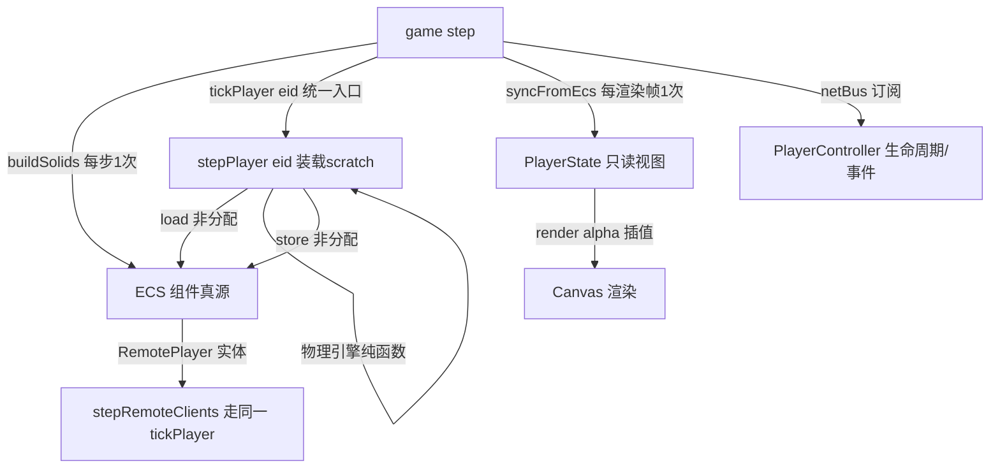

## 用户需求

对《Dash》几何游戏做一轮"架构债 + 确定性 bug + 性能"的集中整治，共 9 项，一次全部完成，按用户列出的顺序执行。

## 功能内容

**一、架构债（1-4）**

1. **玩家 ECS 迁移收尾（A 路线）**：物理直接读写 ECS 组件，`stepPlayerGeneric(p)` 升级为 `stepPlayer(eid)` 入口；PlayerState 降级为渲染只读视图；删除 `hydrateFrom` 与 game/index.ts 中 6 处"防下帧 hydrate 覆盖"的 syncToEcs 补丁；RemotePlayer 也拥有实体，混合范式消失。
2. **统一本地/远程 tick 管线**：抽出 `tickPlayer(p, input, ctx)`，消灭 stepRemoteClients 手抄的平行管线；远程补齐 updateCollisionSystem、拾取改为碰撞版；本地/远程差异由 ctx 回调注入。
3. **UI 状态机统一**：单一真源（gs.screen + 场景状态），场景名改为派生只读；lobby/gallery/instructions 三个独立标志位改为栈式 overlay；UI 回调不再绕过真源直调 ui.show。
4. **事件通道统一**：playerController.onEvent 并入 netBus，TriggerSystem 只订阅一个总线。

**二、确定性 bug（5-6）**

5. view 变量名遮蔽：index.ts:195 局部 `view` 改名 `ecsView`，消除对 core/camera 导入 view 的遮蔽。
6. Prefabs/Scene 与 Prefabs/Scenes 并存：sceneFactory.ts 并入 Scenes/，更新全部 import，移除以 s 为差的隐患目录。

**三、性能（7-9）**

7. buildSolids() 每物理步从 N+1 次重建降为 1 次。
8. 保留 120Hz 物理，渲染侧加 alpha 插值（alpha=acc/FDT，玩家与移动平台的上一帧状态存储）。
9. UI 静态资源缓存：uiAtmosphere 全屏晕影、Button 渐变改为缓存；hud 小地图 query 数组模块级复用；gallery 分页 slice 改为缓存。

## 硬约束

- S1-S8 金测试逐帧轨迹必须保持不变（确定性物理不得改数值），`stepPlayerGeneric` 作为纯物理函数保持 API 与行为冻结。
- 所有改动不得改变物理数值结果；渲染类改动只影响表现层。

## 技术栈

- TypeScript + Vite + bitecs（ECS）+ Canvas 2D，全部沿用现有技术栈，不引入新依赖。

## 实现方案

### 1. 问题 1：ECS 组件真源化（A 路线）

- **策略**：物理引擎核心保持 PlayerState 形状的纯函数（金测试逐帧冻结此行为），在 `player/index.ts` 新增 eid 入口 `stepPlayer(eid, input, dt, isLocal, outSignals)`：进入时用**模块级复用 scratch**（非分配）从组件装载，运行共享引擎，退出时整写回组件。每实体每物理步恰好一次装载/一次写回——跨帧影子状态、双写、每步分配全部消失。
- 关键理由：直接全部改 SoA 索引访问（约 150 处字段引用）对 S1-S8 风险过高且无额外收益；scratch 复用实现零分配 + 单同步点 + 金测试零破坏，外部契约即"物理取 eid、组件唯一权威、PlayerState 仅渲染只读视图"。
- `playerEntity.ts` 增加非分配版 `loadPlayerComponents(eid, out)` / `storePlayerComponents(eid, p)`（复杂对象 impulses/track/plat/backpack/modifiers 直接传引用不拷贝，物理原地变更）；`syncFromEcs` 保留为每渲染帧一次的派生视图。
- 新增 `ensureRemotePlayerEntity(rp)`：远程玩家建实体并初始化 AoS 侧表；stepRemoteClients 改走 `stepPlayer(rp.eid, ...)` 后经 `syncFromEcs(rp.eid)` 派生 rp 供广播/渲染。
- 删除 PlayerController.hydrateFrom、game/index.ts 中 6 处 syncToEcs 补丁及死亡分支补丁（204/210）；render 每帧 `ecsView = syncFromEcs(getPlayerEid())` 一次。

### 2. 问题 2：统一 tick 管线

- 新建 `src/systems/player/tick.ts`，导出 `tickPlayer(eid, input, ctx: { dt, isLocal, hookEdge, aim, sfx, onEvent })`，内部按序：死亡计时/复活（client 非权威仅 maintainDeathVisual）→ `stepPlayer(eid, ...)`（ControlMode 组件仲裁）→ hazard KillRequest → 碰撞版收集 → 检查点 → 4 种道具 → 钩锁 → buff 计时/reconcile → updateCollisionSystem → stepPlayerAnimation → 曳光 → 经 ctx.onEvent 发事件。
- game/index.ts 本地路径与 stepRemoteClients 均改为调用 tickPlayer：本地注入 sfx=true + 原 wirePlayerEvents 处理器；远程注入 sfx=false + 房主事件处理器（特效 + 广播）。

### 3. 问题 3：UI 状态机统一

- gs 增加单一场景真源（如 `gs.scene: 'menu'|'lobby'|'gallery'|'instructions'|'prepare'|'mapSelect'|'charSelect'`）；叠层（pause/dev + 三弹窗）改为 `ui.overlays` 栈（push/pop），`ui.currentName` 改为从 gs.screen + gs.scene + overlays 推导的派生只读（getter 或同步函数）。
- 所有写入走唯一入口 `ui.show(...)`（内部写 gs.screen/gs.scene/overlay 栈后重算派生），scenes.ts 的 98/102 行回调、render() 分支、handleKeyDown 分支全部改读真源，删除 syncUI() 的 if 推导。

### 4. 问题 4：事件通道统一

- PlayerEvent 类型迁入 netBus（或独立 events 类型模块），wirePlayerEvents 改为 `netBus.on('player:*'...)` 订阅（含 fireTriggers 逻辑），PlayerController 不再持有 onEvent 回调字段；TriggerSystem 只订阅 netBus。net.on 保持为网络通道不并入（职责不同），在代码注释中明确分离。

### 5. 问题 5+6：改名与目录合并

- index.ts 局部视图变量改名 `ecsView`（与第 1 项改造同点落地）。
- `Prefabs/Scene/sceneFactory.ts` 移到 `Prefabs/Scenes/`，更新 config/level.ts 与两个 smoke 测试 import，删除 Scene/ 目录与空 AGENT.md。

### 6. 问题 7：buildSolids 上移

- game step() 开头每物理步调用一次 buildSolids()；`stepFreePhysics` 增加 `solidsPrebuilt = false` 参数（生产路径传 true 跳过重建，金测试走默认值不破坏）。已确认所有依赖 solidsNow/hookTargetsNow 的物理函数均在同一 step() 内被调用，无跨步脏缓存风险。

### 7. 问题 8：渲染 alpha 插值

- frame() 物理批步前快照玩家（prevX/prevY）与移动平台世界位置（模块级复用数组，每物理步覆盖）；render 用 `alpha = clamp(acc / FDT, 0, 1)` 对玩家与移动平台绘制位置 lerp。物理仍 120Hz 固定步长，插值仅表现层，不影响确定性。

### 8. 问题 9：UI 资源缓存

- uiAtmosphere.ts:104 晕影渐变按 (VW,VH,DPR) 缓存，仅 resize 时重建；Button.ts 渐变按参数缓存（模块级 Map/离屏 canvas）；hud.ts 小地图 query 结果改模块级复用数组（length=0 复用，qNovaEntity 不再整数组丢弃）；gallery.ts 分页 slice 改为页切换时缓存页数组。

## 架构设计



## 目录结构

```
src/
├── systems/player/
│   ├── index.ts          # [MODIFY] 新增 stepPlayer(eid) 入口、scratch 装载/写回、buildSolids 增加 solidsPrebuilt 参数
│   ├── playerEntity.ts   # [MODIFY] 非分配 loadPlayerComponents/storePlayerComponents、ensureRemotePlayerEntity、插值上一帧快照槽
│   ├── PlayerController.ts # [MODIFY] 删除 hydrateFrom/onEvent 字段，改为实体生命周期 + 渲染视图持有者，die/respawn 直写组件
│   └── tick.ts           # [NEW] tickPlayer(eid,input,ctx) 统一管线（死亡/物理/危险/收集/检查点/道具/钩锁/buff/碰撞/动画/事件）
├── systems/game/index.ts # [MODIFY] 删 6 处补丁与 hydrateFrom；本地+远程改走 tickPlayer；step 顶部 buildSolids；view→ecsView；render alpha 插值；render/handleKeyDown 读真源
├── systems/ui/scenes.ts  # [MODIFY] 回调改走 ui.show 唯一写入口
├── systems/ui/index.ts   # [MODIFY] currentName 改派生只读、overlay 栈实现
├── core/netBus.ts        # [MODIFY] 玩家事件类型与订阅注册（wirePlayerEvents 迁入）
├── systems/uiAtmosphere.ts # [MODIFY] 晕影渐变缓存
├── core/uiComponent/Button.ts # [MODIFY] 渐变缓存
├── systems/ui/hud.ts     # [MODIFY] query 数组模块级复用
├── systems/ui/gallery.ts # [MODIFY] 分页缓存
├── Prefabs/Scenes/sceneFactory.ts # [NEW] 自 Scene/ 迁入
├── config/level.ts       # [MODIFY] sceneFactory import 路径
├── __smoke__/ecs.smoke.test.ts / auraTrigger.smoke.test.ts # [MODIFY] import 路径
└── __smoke__/physics.golden.test.ts # 保持不变，作为回归护栏
```

## 执行要点

- **金测试护栏**：每完成一项即运行 `npx vitest run src/__smoke__/physics.golden.test.ts` 确认 S1-S8 不变；最终跑全部 smoke 测试 + `tsc --noEmit`。
- **性能**：scratch 装载/写回必须零分配（复用模块级对象与 side-table 引用，禁用 slice/map）；buildSolids 生产路径只执行一次；插值快照用固定大小复用数组。
- **改动顺序按用户要求**：1→2→3→4→5→6→7→8→9；问题 1 与 7 均触碰物理入口，需在同一文件内协调 solidsPrebuilt 参数。
- **回归风险**：问题 1/7 是最大风险点，改造时保持 stepPlayerGeneric 冻结；问题 2 远程补 updateCollisionSystem 属行为变更，需在多人联机路径验证。

## Agent 扩展

### Skill

- **lsp-code-analysis**
- Purpose: 在问题 1/2/6/7 改造前做影响面分析——查找 syncToEcs/syncFromEcs/hydrateFrom/stepPlayerGeneric/stepPlayerByMode/buildSolids/updateCollisionSystem/sceneFactory 的全部调用点与引用，确保无遗漏调用方
- Expected outcome: 拿到完整的调用点清单，改造后无孤儿引用、无遗漏 import 更新

### SubAgent

- **code-explorer**
- Purpose: 大范围多文件核查——验证 stepRemoteClients 手抄管线的每一项（危险/收集/道具/钩锁/buff）与本地路径的对称性，以及 Scenes/Scene 目录合并后的残留引用
- Expected outcome: 输出本地/远程管线差异清单与目录迁移影响文件清单，支撑 tickPlayer 抽取与目录合并无遗漏