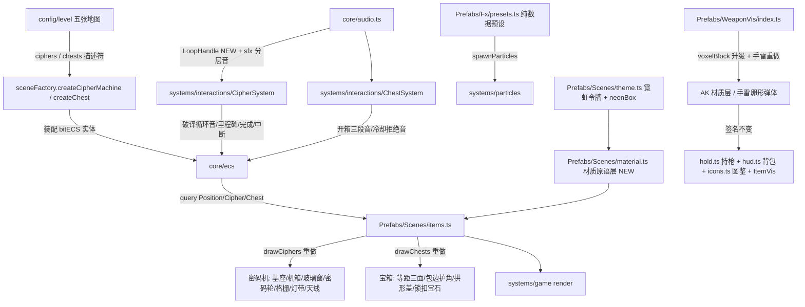

## 产品概述

对游戏中新增的场景交互物与武器（密码机、宝箱、AK 步枪、手雷）做一轮完整的建模重做、美术质感升级与音效补齐。当前这四类物品均为粗糙的纯色块/简单几何体绘制，缺少材质、光影与体积感，音效也存在缺失与复用（密码机完成音直接复用了检查点音、破译过程全程无声音反馈）。

## 核心功能

1. **统一材质语言**：抽出可复用的绘制原语层（金属板材 / 玻璃面板 / 霓虹灯带 / 铆钉 / 散热格栅 / 接地光晕 / 拉丝纹理），全部复用现有霓虹主题令牌，保证新物品与场景风格完全统一，不产生割裂感。
2. **密码机建模重做**：从纯色方块升级为「接地光晕 → 梯形基座 → 金属机箱 → 玻璃观察窗 → 密码轮组 → 散热格栅 → 霓虹边框灯带 → 天线信号灯」的多层结构；未完成态（橙黄警示、密码轮滚动、扫描线往复、呼吸灯带）与完成态（青绿安全、轮组锁死、光核常亮、信号波）双状态表现。
3. **宝箱建模重做**：从五边形色块升级为等距透视三面箱体（顶亮/左中/右暗）+ 金属包边护角 + 拱形箱盖绕后缘转轴开合 + 中央锁扣宝石；冷却态（压暗、锁链、沿轮廓的冷却描边进度、剩余秒数）、可开启态（呼吸辉光、宝石脉动、E 提示）、开启态（盖子弹翻转回弹、箱内光柱喷出、掉落物浮现）三状态表现。
4. **武器建模升级**：AK 保留分件结构并升级材质层（金属拉丝、木纹层次、环境暗部、枪机拉柄与护木箍环补件、枪口内壁）；手雷从「渐变球 + 米字线」重做为卵形弹体 + 铸造分段纹 + 螺纹引信座 + 保险握片 + 拉环开口销。图标与持枪表现同步获得材质层，导出签名保持不变。
5. **音效全面补齐**：密码机（接入音、随进度升调的破译循环持续音、25%/50%/75% 里程碑音、专属完成音、中断音）、宝箱（冷却拒绝音、开箱三段分层音、就绪音）、武器（AK/手雷差异化拾取音、切枪音、开火尾音层次、换弹插入闷响）。全部为纯代码合成，零外部音频资源。
6. **配套特效补充**：破译扫描光点、机顶排气、锁扣弹开碎屑、开箱光柱、掉落物浮现光环等粒子预设。

## 技术栈

沿用项目现有技术栈，不引入任何新依赖：

- 渲染：Canvas 2D（`core/canvas` 的 `ctx` / `VW` / `VH`，`core/camera` 的 `sx` / `sy` / `view`）
- 架构：bitECS（SoA 组件 + 标签组件）+ 分层架构（`Prefabs/` = 怎么画，`systems/` = 怎么做）
- 音频：WebAudio 纯代码合成（`core/audio.ts` 的 `osc` / `noise` + ADSR + `gate` 节流 + `sfxBus`）
- 构建：`tsc && vite build`；测试：vitest + playwright 冒烟

## 实现方案

**总体策略**：先在 `Prefabs/Scenes/` 新增一层**纯绘制的材质原语**（`material.ts`），作为密码机 / 宝箱 / 武器三类重做的公共底座；再分别重写各物品的绘制函数；最后在 `systems/interactions` 与 `core/audio` 补齐音效与生命周期接线。

**关键技术决策与权衡**：

1. **新增 `material.ts` 而非直接内联写死在各 draw 函数里**
密码机、宝箱、AK 都需要金属拉丝 / 灯带 / 铆钉 / 接地光晕，当前 `drawCiphers` 与 `drawChests` 已各自重复写了一遍接地光晕。抽成原语后三处共享一份实现，且天然与 `theme.ts` 的 `neonBox` 同级、同风格。这是 DRY 与 SoC 的直接收益，不是过度设计。

2. **严格走 `theme.ts` 令牌，不新增第二套色彩体系**
所有原语只接受 `hue` 参数，内部拼 `hsla(hue, ...)`，沿用 `T.topBarH` / `T.innerInset` / `T.bottomShade` / `T.rimAlpha` / `T.rimOut` / `T.rimLight` / `glass*` 等已有令牌，光晕仍只有三档（静态 12 / 可动 14 / 触发 16）。这样新物品与平台、轨道、弹簧的视觉语言完全一致，不会出现"风格割裂"。

3. **保持 `WeaponVis` 的导出签名完全不变**
`drawAKIcon(cx, cy, r)` / `drawGrenadeIcon(cx, cy, r)` / `drawWeaponModel(kind, r)` 被 `systems/items/hold.ts`（持枪）、`systems/ui/icons.ts`、`systems/ui/hud.ts`（背包栏 / 图鉴 / 武器槽）、`Prefabs/ItemVis`（转发）、`Prefabs/Scenes/items.ts`（拾取物）五处调用。签名不动 = 调用链零改动，建模升级的收益自动传导到持枪、HUD、图鉴、拾取物全链路。AK 的参考坐标系 `x∈[2,39] / y∈[-11,4]` 与 `drawAKShape` 的 `s = r*0.09; translate(-20, 3)` 映射也必须保持不变，否则所有调用方的尺寸/对齐全部错位。

4. **循环音需新增 `LoopHandle` 机制**
现有 `osc()` / `noise()` 都是"一次性节点 + onended 自动 disconnect"设计，没有常驻循环音。密码机的破译持续音必须能 start / stop / 随进度调制，因此需要新增一个 `loopTone()` 返回句柄的封装，挂 `sfxBus`，`stop()` 走 gain ramp 后延迟 disconnect，沿用现有防节点泄漏约定。**这是本次唯一的音频层结构性新增**，其余音效都是往 `sfx` 表里加方法。

5. **循环音的生命周期必须由系统调用方显式管理**
`updateCipherSystem` 是每帧调用且无状态的，需要在模块级维护 `Map<entityId, LoopHandle>`，并在「进入破译 / 持续破译 / 松手中断 / 完成 / 切图」五个时机正确启停。切图时必须全量 stop（`resetCipherSpark` 已有切图钩子，一并扩展），否则会残留常驻节点。

## 性能与可靠性

- **材质层必须按屏幕像素面积做 LOD**：拉丝纹理、散热格栅、铆钉阵列在小尺寸（如缩略图标、远处宝箱）下既看不见又是纯浪费。原语内部按 `w * h` 阈值跳过细节层，只保留底色 + 描边 + 顶光。
- **`shadowBlur` 是 Canvas 2D 最贵的操作之一**：约束每个物品每帧最多 2-3 次 shadow 状态切换（灯带一次、本体描边一次），绘制完立即归零，禁止在循环内反复设置。
- **接地光晕合并为单次绘制**：`lighter` 混合 + 一次 `arc` 填充，不叠加多层径向渐变。
- 每帧 `createLinearGradient` / `createRadialGradient` 的对象创建与现有代码保持一致（不额外增加数量），不引入渐变缓存（Canvas 渐变绑定坐标，缓存易错且收益有限）。
- **联机语义不可破坏**：`isRemote` 分支一律不播本地音效（现有约定），host 仍是破译进度与宝箱状态的唯一权威；音效与粒子只是表现层，不写任何 ECS 状态。
- **不改变**：ECS 组件字段、网络协议（`NetCipherState` / `NetChestState`）、五张地图的 `ciphers: [...]` / `chests: [...]` 配置、碰撞体尺寸（`createCipherMachine` 的 `2.0×2.4`、`createChest` 的 `2.2×2.0`）。视觉重做不得影响交互判定。

## 架构设计



**分层不变**：`Prefabs/` 只负责"怎么画"（几何、颜色、发光、动画形态），`systems/` 负责"怎么做"。`material.ts` 是纯绘制原语，无状态、无游戏逻辑、不读 ECS。

## 目录结构

```
fight/
├── src/
│   ├── Prefabs/
│   │   ├── Scenes/
│   │   │   ├── material.ts      # [NEW] 材质绘制原语层。导出 metalPanel（金属板材：渐变底色+拉丝+顶光+底阴影+边缘高光）、
│   │   │   │                    #   glassPanel（玻璃面板：内腔暗底+菲涅尔上下亮边+镜面高光条，复用 T.glass* 令牌）、
│   │   │   │                    #   neonTube（霓虹灯带：外冷晕+内亮芯双描边）、rivets（铆钉阵列）、vents（散热格栅）、
│   │   │   │                    #   groundGlow（接地椭圆光晕，lighter 混合）、brushed（拉丝纹理）。
│   │   │   │                    #   全部只接受 hue + 尺寸参数，内部拼 hsla 复用 T 令牌；按像素面积做细节层 LOD；
│   │   │   │                    #   纯绘制，无状态、无 ECS 依赖、无游戏逻辑。
│   │   │   ├── theme.ts         # [MODIFY] 视需要少量扩充令牌（金属拉丝密度/倒角宽度/锁链色等），
│   │   │   │                    #   严禁修改已有令牌取值（会影响平台/轨道/弹簧等全部场景道具）。
│   │   │   ├── items.ts         # [MODIFY] 重做 drawCiphers（行 112-261）与 drawChests（行 268-418）。
│   │   │   │                    #   导出名与签名不变，drawWeaponPickups 及五个道具拾取物绘制保持不动。
│   │   │   └── index.ts         # [MODIFY] barrel 导出新增 material.ts。
│   │   ├── WeaponVis/
│   │   │   └── index.ts         # [MODIFY] voxelBlock 材质档升级（metal/wood/rough/polished）；
│   │   │                        #   paintAK 补件（枪机拉柄/护木箍环/弹匣卡笋/枪带环/枪口内壁），
│   │   │                        #   参考坐标系与 drawAKShape 的 scale/translate 映射严禁改动；
│   │   │                        #   drawGrenadeShape 重做（卵形弹体/铸造分段纹/螺纹引信座/保险握片/拉环开口销/双高光）；
│   │   │                        #   drawAKIcon / drawGrenadeIcon 加材质层，签名 (cx,cy,r) 不变。
│   │   ├── Fx/
│   │   │   └── presets.ts       # [MODIFY] 新增 cipherScan / cipherSteam / chestUnlock / chestBeam / lootPop 等纯数据预设。
│   │   ├── AGENT.md             # [MODIFY] 目录说明补 material.ts。
│   │   └── Scenes/AGENT.md      # [MODIFY] 目录说明补 material.ts 与数据流。
│   ├── core/
│   │   └── audio.ts             # [MODIFY] 新增 LoopHandle 接口 + loopTone()（常驻循环音，挂 sfxBus，
│   │                            #   stop 走 gain ramp 后延迟 disconnect，沿用现有防泄漏约定）；
│   │                            #   sfx 表新增：cipherStart / cipherMilestone / cipherDone / cipherAbort /
│   │                            #   chestLocked / weaponPickupAK / weaponPickupGrenade / weaponSwap；
│   │                            #   重做 chestOpen（三段分层）、升级 shot（加低频尾音）、reload（加弹匣插入闷响）。
│   └── systems/
│       ├── interactions/
│       │   ├── CipherSystem.ts  # [MODIFY] 新增模块级 Map<eid, LoopHandle> 管理破译循环音；
│       │   │                    #   接入/持续(setParam 随 progress 升调)/中断(Abort)/完成(Done 替换现有 sfx.cp) 五时机；
│       │   │                    #   25/50/75% 里程碑音；isRemote 不播本地音；
│       │   │                    #   resetCipherSpark() 扩展为切图时全量 stop 循环音。
│       │   └── ChestSystem.ts   # [MODIFY] state===0 且玩家在触发区内按 E → sfx.chestLocked（节流防按住连触发）；
│       │                        #   开箱改播分层 chestOpen。
│       └── game/
│           └── index.ts         # [MODIFY] 切图/重置路径调用循环音清理；确认 render() 调用顺序不变。
└── 工具/gallery/
    └── prefabs-data.js          # [MODIFY] 补 cipher（密码机）与 chest（宝箱）条目，供 prefab-gallery 视觉对比。
```

## 关键代码结构

```ts
/* src/Prefabs/Scenes/material.ts —— 材质原语统一签名风格（只接受 hue，内部复用 T 令牌） */
export function metalPanel(
  x: number, y: number, w: number, h: number,
  o?: { hue?: number; base?: string; brush?: boolean; bevel?: number; shade?: number },
): void;

export function glassPanel(
  x: number, y: number, w: number, h: number,
  o?: { hue?: number; alpha?: number },
): void;

export function neonTube(
  pts: readonly [number, number][],
  o?: { hue?: number; glow?: number; lw?: number; closed?: boolean },
): void;

/* src/core/audio.ts —— 循环音句柄（本次唯一的音频层结构性新增） */
export interface LoopHandle {
  /** 0..1，映射为音高 / 滤波截止 / 增益的联合调制 */
  setParam(v: number): void;
  /** 增益 ramp 后延迟 disconnect，杜绝爆音与节点泄漏 */
  stop(): void;
}
export function loopTone(o: {
  f0: number; type?: OscillatorType; lp?: number; vol?: number; pan?: number;
}): LoopHandle;
```

## 执行注意事项

- **先建原语、后改物品**：`material.ts` 是三个重做任务的公共依赖，必须先落地并被三处复用，避免各自内联导致二次重构。
- **视觉尺寸与碰撞体解耦**：密码机视觉 `boxW = 1.15*S` / `boxH = 1.7*S`，宝箱 `boxW = r.w*S` / `boxH = (r.top - r.y)*S`，重做时不得改变视觉包围盒，否则与 `setCollider` 的触发区（2.0×2.4 / 2.2×2.0）视觉错位。
- **动画一律 `gs.time` 正弦驱动**，基准角速度沿用 `T.breathSpeed = 2.4`，禁止引入新的时间源或自行累加计时器（会破坏暂停/切图一致性）。
- **建模单一来源铁律**：武器形状只能存在于 `WeaponVis`，场景拾取物、HUD、持枪、图鉴一律从这里取，不得在 `items.ts` 或 `hud.ts` 复制一份武器绘制代码。
- **节流**：宝箱拒绝音、密码机里程碑音必须过 `gate()`，防止玩家按住 E 时每帧触发糊成一团。
- **回归面**：`npm run build`（`tsc && vite build`）必须通过；`src/__smoke__/cipher.smoke.test.ts` 与 `ecs.smoke.test.ts` 必须保持通过（密码机 ECS 契约未变，冒烟测试应零改动通过）。
- **视觉验收**：用 `工具/gallery/prefab-gallery.html` 做改前/改后对比（需先补 cipher / chest 条目），并确认 `sync-prefabs.mjs` 同步脚本不会覆盖手工条目。

## Agent Extensions

### SubAgent

- **code-explorer**
- 用途：在动手前核实 `drawAKIcon` / `drawGrenadeIcon` / `drawWeaponModel` / `drawWeaponIcon` 的全部调用方与 `FxPreset` 可用 `ParticleKind` 取值，确认 `systems/particles.spawnParticles` 的发射约定
- 预期产出：完整的调用点清单与类型取值清单，确保武器建模升级的传导链路零遗漏、FX 预设用到的粒子类型均为已支持类型

### Skill

- **lsp-code-analysis**
- 用途：对 `Prefabs/WeaponVis` 的导出符号做 find references / call hierarchy 影响分析，并在改动后复核引用完整性
- 预期产出：改动前后的引用集合一致（无新增悬空引用），确认持枪、HUD 背包栏、图鉴、ItemVis 转发、场景拾取物五条调用链全部仍然成立